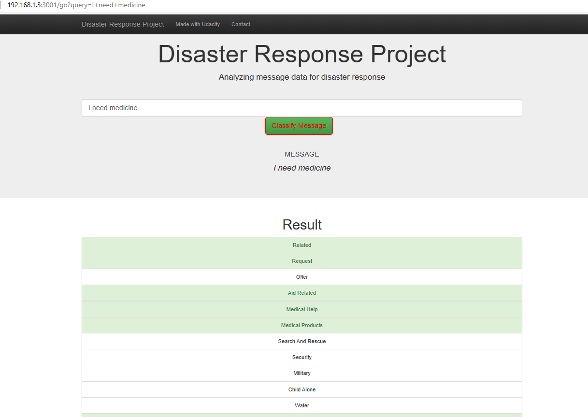

# Disaster Response Pipeline Project

[comment]: # (https://www.freepik.com/premium-vector/fire-truck-cartoon-clipart-colored-illustration_24434623.htm)</td>
[comment]: # (https://de.freepik.com/vektoren-premium/polizeiauto-cartoon-clipart-farbige-illustration_24434932.htm)
[comment]: # (https://cobi.eu/product/barkas-b1000-krankenwagen,3403)

### Summary

This disaster response project is a GUI project triggered by the udacity "data-scientist-nanodegree" program (see https://www.udacity.com/).
Hereby, a user can enter a disaster text message into a textbox of a web application, which is then classified among 36 categories covering requests, medical help, etc.
The positive results of these multioutput classification are shown by highlighting the corresponding categories.

## Use case
If an emergency message is entering an emergency service, their operator has to decide quickly what to do.
The callers are often under shock or panicked - so no information should get lost.
In such moments time is valueable and seconds may decide over life or death.
A first help would be to understand the kind of emergency. Often it is even more than one.
Such classification can support decision making by the operators and thus save valueable time.

### Raw model

This project is a simple raw model for a multiclass classification of text messages.
Further possible applications include a tonality or topic analysis, a language or dialect analysis, or an analysis of diagnostic findings etc.
This project also aims to produce a deployable web app.

### Install/run instructions:
0. Install the packages denoted in requirements_working_configuration.txt preferably in a virtual environment as exemplarily shown for the windows command prompt:

      projectfolder:> python -m venv venv
      projectfolder:> cd venv\Scripts
      projectfolder\venv\Scripts> .\activate.bat
      projectfolder\venv\Scripts> cd ..\..
      projectfolder:> python -m pip install -r requirements_working_configuration.txt

      Within your project folder "projectfolder" use the "python" command as long as the virtual environment is activated
      (if not working with/on the project, the virtual environment should be deactivated by executing projectfolder\venv\Scripts\deactivate.bat).

1. Run the following commands in the project's root directory to set up your database and model.

    - To run ETL pipeline that cleans data and stores in database
        `python data/process_data.py data/disaster_messages.csv data/disaster_categories.csv data/DisasterResponse.db`
    - To run ML pipeline that trains classifier and saves
        `python models/train_classifier.py data/DisasterResponse.db models/classifier.pkl`
        (an exemplary output for an 80-20 train-test split is provided in ml_pipeline_output_example.txt (corresponding pickle file is in models/classifier.pkl - a recreation takes several hours))

2. Run the following command in the app's directory to run your web app.
    `python run.py`

3. Go to the displayed address - e.g., http://192.168.1.3:3001/

### Files in the repository

app
| - template
| |- master.html # main page of web app
| |- go.html # classification result page of web app
|- run.py # Flask file that runs app
data
|- disaster_categories.csv # data to process
|- disaster_messages.csv # data to process
|- process_data.py
|- InsertDatabaseName.db # database to save clean data to
models
|- transformer_module.py #
|- train_classifier.py #
|- classifier_module.py #
|- classifier.pkl # saved model
README.md
requirements.txt # list of required packages
requirements_working_configuration.txt # packages of working configuration used during development
use_case_example.png # picture showing use case
ml_pipeline_output_example.txt
.gitignore

### Technical explanations:

The model is based on the "word to vector" (word2vec) model (https://github.com/RaRe-Technologies/gensim) in which contrary to the more simple bag of words approach, the embedding to nearby words is effectively taken into account.
In the framework of this model each word is represented by a vector.
The higher the dimensionality of these vectors, the more expressive are the euclidian distances between words for representing the meaning of each word.
Similar words have thus a very short distance.
As the intention is to group similar meaning words, one may not increase the dimensionality too much; otherwise all words would have its distinct position in a high dimensional vector space and would stand out unique (as in the bag of words approach).
So, one has to compromise/optimize.

In the fit procedure the digitized projections of these vectors are transformed into onehotencoded vectors.
For each text message a histogram over all onehotencoded vectors is created. The plethora of histograms then enters the TF-IDF-Transformer.
Corresponding results are then passed to the StandardScaler (its mean stays untouched due to sparsity of data) and finally passed to the classifier.
The classifier consists of an augmented version of the OneVsRest-classifier which uses the LogisticRegression classifier.

The classifier is converging to its final solution using the cross validation method GridSearchCV with the f1-score of class 1 forming the metric that is aimed being maximized.
The f1-score of class 1 was chosen over accuracy since one prefers in emergency situations rather having a false positive classification (affecting precision of class 1) than a false negative (affecting precision and recall of class 1).
This strategy together with a balanced class weight pushes the sensitivity of the classifier to the right direction as in the majority of cases a positive classification is rare and a classifier which always produces "0" would otherwise produce a good accuracy.

In order to proof that the word2vec model can be superior with respect to the bag of words model, the hyperparameter setting covers one setting for the word2vec and one for the bag of words approach.
GridSearchCV-algorithm checks out both settings and compares so found scores.
It turns out that the setting comprising the word2vec model actually wins.
The difference in score is about 0.358 vs 0.345 for an 80-20 train-test-split.

With respect to the training data, is worth-mentioning that one can recognize that text messages, for which a relation to categories was investigated, are categorized with "related=1".
Non-investigated text messages are categorized with "0" throughout all target variables (including "related" - see Figure 2 in the web app).
These non-investigated text messages were excluded from training and evaluating as one should not know from the text alone whether it was investigated or not.

In the following, a graphical representation for a disaster message "I need medicine" is shown.

